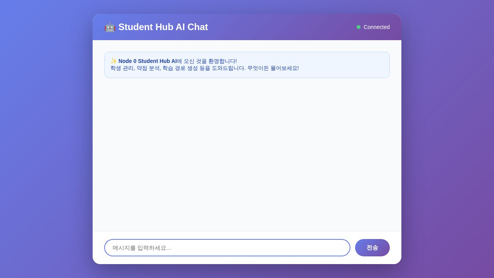
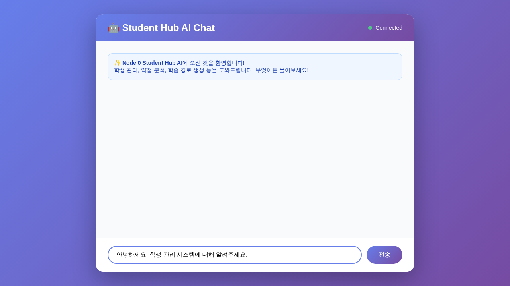
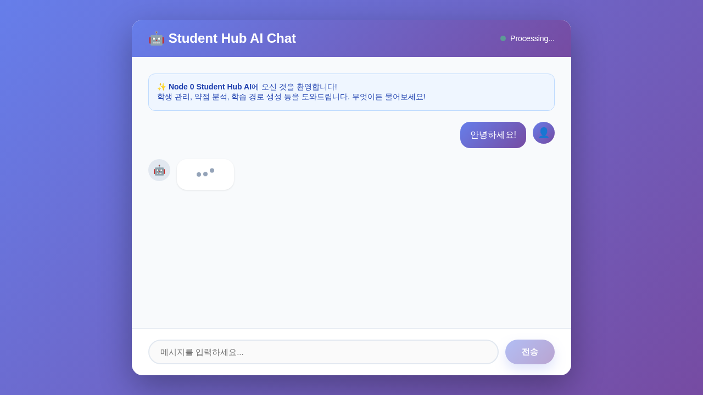
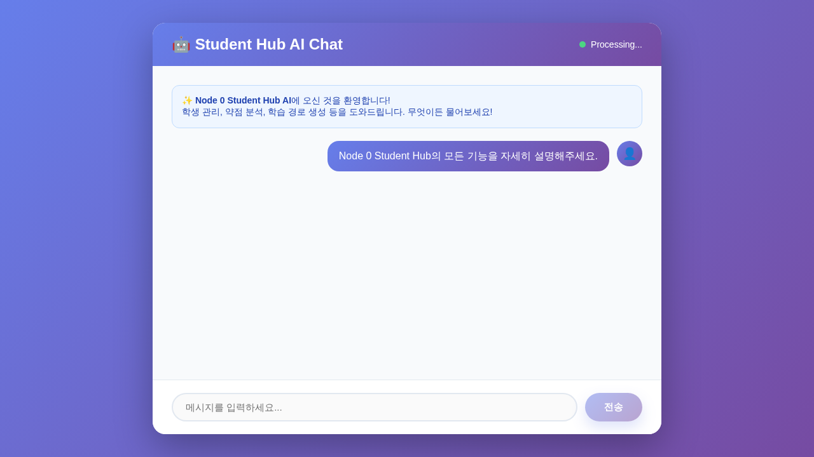
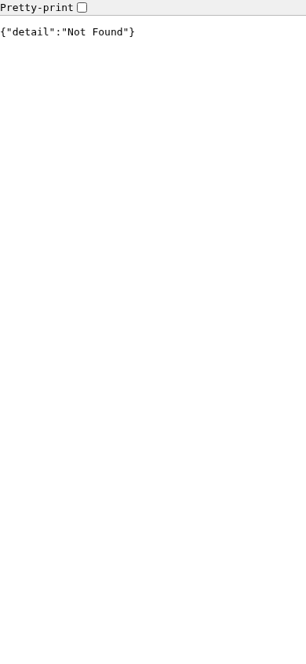
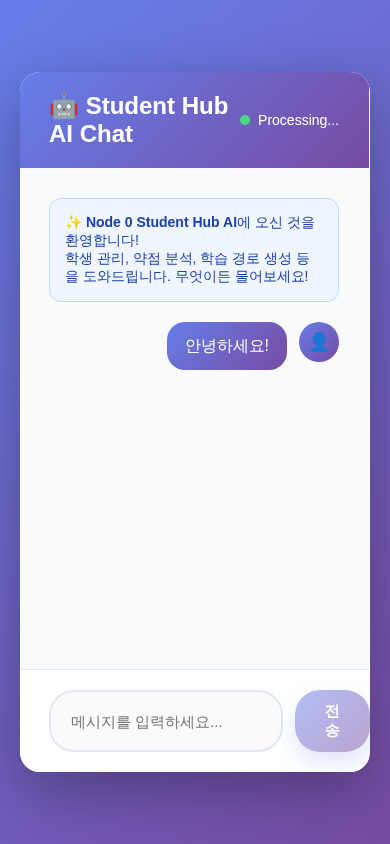
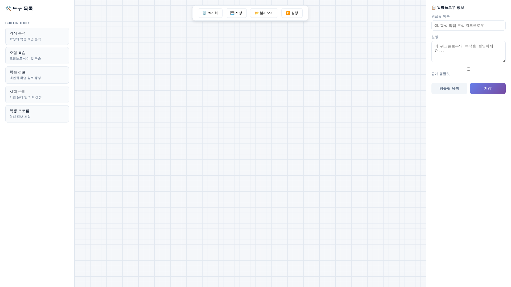
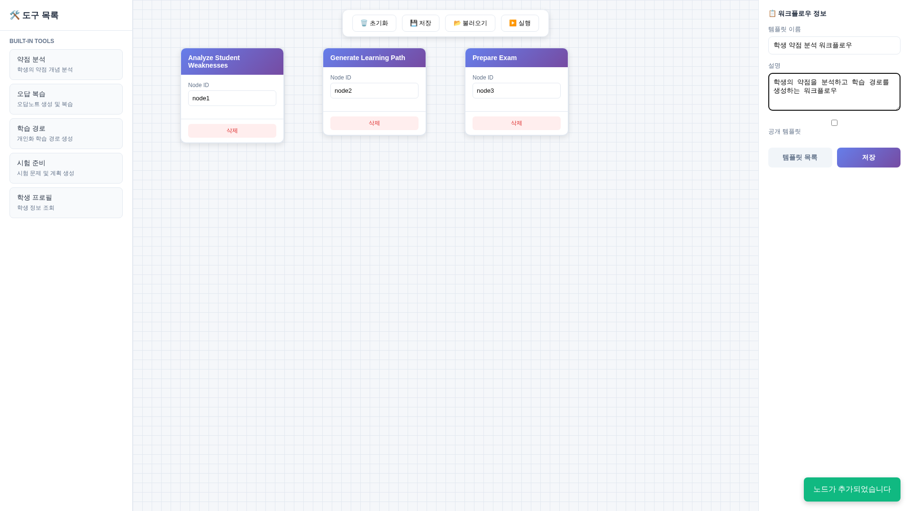
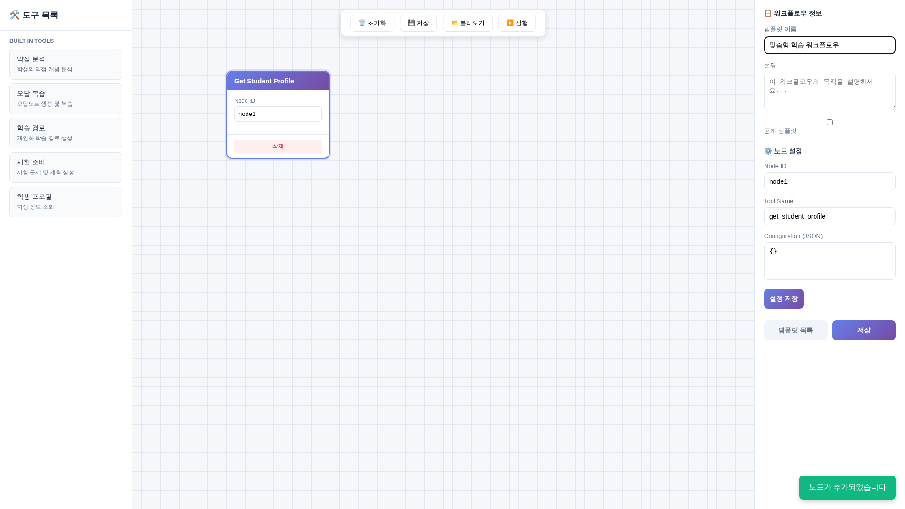

# Node 0 Student Hub - 대화형 AI 시스템 사용자 메뉴얼

## 📋 목차

1. [시스템 개요](#시스템-개요)
2. [주요 기능](#주요-기능)
3. [설치 및 실행](#설치-및-실행)
4. [사용자 가이드](#사용자-가이드)
5. [API 문서](#api-문서)
6. [스크린샷 갤러리](#스크린샷-갤러리)
7. [트러블슈팅](#트러블슈팅)

---

## 🎯 시스템 개요

Node 0 Student Hub는 선생님이 학생 데이터를 손쉽게 조회하고 분석할 수 있도록 **대화형 AI 인터페이스**를 제공하는 학생 관리 시스템입니다.

### 핵심 특징

- ✅ **로컬 LLM 통합**: Ollama를 사용한 프라이버시 보호형 AI (llama3:latest)
- ✅ **실시간 스트리밍**: SSE(Server-Sent Events)를 통한 실시간 응답
- ✅ **MCP 도구 통합**: 5가지 built-in 분석 도구
- ✅ **워크플로우 빌더**: 드래그 앤 드롭 방식의 비주얼 워크플로우 편집기
- ✅ **대화 히스토리 관리**: 세션별 컨텍스트 유지
- ✅ **반응형 UI**: PC 및 모바일 지원

### 시스템 아키텍처

```
┌─────────────────┐
│   Chat UI       │  ← 사용자 인터페이스 (HTML/JS)
│  (chat_test.html)│
└────────┬────────┘
         │ HTTP/SSE
┌────────▼────────┐
│  FastAPI Server │  ← REST API (포트 8000)
│  (api_app.py)   │
└────────┬────────┘
         │
┌────────▼────────────┐
│ AgentOrchestrator  │  ← LLM 통합 (Ollama)
│  (orchestrator.py)  │
└────────┬────────────┘
         │
┌────────▼────────────┐
│   MCP Tools (5개)   │  ← 학생 분석 도구
│  - 약점 분석        │
│  - 오답 복습        │
│  - 학습 경로 생성   │
│  - 시험 준비        │
│  - 학생 프로필 조회  │
└─────────────────────┘
         │
┌────────▼────────────┐
│   PostgreSQL DB     │  ← 학생 데이터 저장
└─────────────────────┘
```

---

## 🚀 주요 기능

### 1. 자연어 대화형 인터페이스

선생님이 자연어로 질문하면 AI가 적절한 도구를 사용해 답변합니다.

**예시:**
- "학생 김철수의 약점을 분석해줘"
- "수학 2-1 단원 시험 문제를 만들어줘"
- "학생들의 전체적인 학습 현황을 알려줘"

### 2. 5가지 MCP Built-in Tools

| 도구 이름 | 설명 | 사용 예시 |
|----------|------|----------|
| **analyze_student_weaknesses** | 학생의 약점 개념 분석 | "김철수의 약점 분석해줘" |
| **create_error_review** | 오답노트 생성 및 복습 스케줄링 | "이 문제 오답 분석해줘" |
| **generate_learning_path** | 개인화 학습 경로 생성 | "이차방정식 학습 경로 만들어줘" |
| **prepare_exam** | 시험 문제 및 학습 계획 생성 | "다음 주 시험 준비 도와줘" |
| **get_student_profile** | 학생 프로필 및 학습 현황 조회 | "김철수 프로필 보여줘" |

### 3. 실시간 스트리밍 응답

AI 응답이 실시간으로 타이핑되어 나타나므로, 즉각적인 피드백을 받을 수 있습니다.

### 4. 대화 히스토리 관리

- 세션별로 대화 컨텍스트 유지 (최근 20개 메시지)
- 이전 대화 내용을 기억하여 자연스러운 다중 턴 대화 지원
- DB에 대화 히스토리 영구 저장

### 5. 워크플로우 빌더 (Visual Workflow Builder)

n8n 스타일의 드래그 앤 드롭 인터페이스로 복잡한 워크플로우를 시각적으로 구성할 수 있습니다.

**주요 기능:**
- 📐 **드래그 앤 드롭**: 5가지 MCP 도구를 캔버스에 드래그하여 배치
- 🔗 **노드 연결**: 도구들을 연결하여 순차적/병렬 실행 흐름 구성
- ⚙️ **노드 설정**: 각 도구의 파라미터를 UI에서 직접 설정
- 💾 **템플릿 저장/로드**: 재사용 가능한 워크플로우 템플릿 생성 및 관리
- ▶️ **즉시 실행**: 구성한 워크플로우를 바로 실행하고 결과 확인

---

## 💻 설치 및 실행

### 사전 요구사항

1. **Python 3.10+** 설치
2. **PostgreSQL** 데이터베이스
3. **Ollama** 로컬 LLM 서버
4. **Node 0 Student Hub** 소스 코드

### 1단계: Ollama 설치 및 모델 다운로드

```bash
# Ollama 설치 (Linux/macOS)
curl -fsSL https://ollama.com/install.sh | sh

# llama3 모델 다운로드
ollama pull llama3

# Ollama 서버 실행
ollama serve
```

### 2단계: Python 의존성 설치

```bash
cd /path/to/node0_student_hub
pip install -r requirements.txt
```

### 3단계: 환경 변수 설정

`.env` 파일을 생성하고 다음 내용을 입력:

```env
# Database
POSTGRES_HOST=localhost
POSTGRES_PORT=5432
POSTGRES_DB=student_hub
POSTGRES_USER=mathesis
POSTGRES_PASSWORD=your_password

# Redis
REDIS_HOST=localhost
REDIS_PORT=6379

# gRPC Ports
GRPC_PORT=50050
GRPC_MCP_PORT=50051
```

### 4단계: 데이터베이스 마이그레이션

```bash
alembic upgrade head
```

### 5단계: FastAPI 서버 실행

```bash
uvicorn app.api_app:app --host 0.0.0.0 --port 8000 --reload
```

### 6단계: 웹 브라우저에서 접속

```
http://localhost:8000/chat-test
```

---

## 📖 사용자 가이드

### Chat UI 사용 방법

#### 1. 초기 화면



웹 브라우저에서 `http://localhost:8000/chat-test`에 접속하면 위와 같은 화면이 나타납니다.

**주요 UI 요소:**
- 🤖 **헤더**: "Student Hub AI Chat" 타이틀과 연결 상태 표시
- 💬 **채팅 영역**: 대화 내용이 표시되는 메인 영역
- ✏️ **입력창**: 메시지를 입력하는 텍스트 필드
- 📤 **전송 버튼**: 메시지를 AI에게 전송

#### 2. 메시지 입력



입력창에 질문이나 요청을 입력합니다. 예:
- "안녕하세요! 학생 관리 시스템에 대해 알려주세요."
- "김철수 학생의 약점을 분석해주세요."

**Tip:** 엔터 키를 누르면 메시지가 전송됩니다.

#### 3. AI 응답 받기



전송 버튼을 클릭하거나 엔터를 누르면:
1. 사용자 메시지가 오른쪽에 보라색 말풍선으로 표시됩니다
2. AI가 처리 중임을 나타내는 타이핑 인디케이터가 나타납니다
3. AI 응답이 왼쪽에 흰색 말풍선으로 실시간 스트리밍됩니다

#### 4. 타이핑 인디케이터



AI가 응답을 준비 중일 때 애니메이션 점 3개가 표시됩니다.

#### 5. 스트리밍 응답


AI 응답이 한 글자씩 실시간으로 타이핑되어 나타납니다. 긴 응답도 기다리지 않고 바로 읽을 수 있습니다.

#### 6. 완성된 응답


응답이 완료되면 전체 메시지가 표시되고, 새로운 질문을 입력할 수 있습니다.

#### 7. 모바일 버전

**모바일 초기 화면:**



**모바일 대화:**



반응형 디자인으로 모바일 기기에서도 최적화된 UI를 제공합니다.

### Workflow Builder 사용 방법

#### 1. Workflow Builder 접속

`http://localhost:8000/workflow-builder`에 접속하여 워크플로우 빌더 UI를 엽니다.



**주요 UI 영역:**
- **왼쪽 패널**: 사용 가능한 5가지 MCP 도구 (드래그 가능)
- **중앙 캔버스**: 워크플로우를 구성하는 작업 공간
- **오른쪽 패널**: 템플릿 설정 및 노드 구성
- **상단 툴바**: 저장, 로드, 실행, 초기화 버튼

#### 2. 워크플로우 구성



**워크플로우 생성 단계:**

1. **템플릿 정보 입력** (오른쪽 패널 상단)
   - 템플릿 이름: "학생 약점 분석 워크플로우"
   - 설명: "학생의 약점을 분석하고 학습 경로를 생성하는 워크플로우"

2. **도구 드래그 앤 드롭**
   - 왼쪽 패널에서 원하는 도구를 선택
   - 캔버스로 드래그하여 배치
   - 여러 노드를 추가하여 복잡한 플로우 구성

3. **노드 배치**
   - 각 노드를 캔버스의 원하는 위치에 배치
   - 실행 순서에 맞게 왼쪽에서 오른쪽으로 배치 권장

**사용 가능한 5가지 도구:**
- 🔍 **약점 분석** (analyze_student_weaknesses)
- 📝 **오답 복습** (create_error_review)
- 🗺️ **학습 경로** (generate_learning_path)
- 📊 **시험 준비** (prepare_exam)
- 👤 **프로필 조회** (get_student_profile)

#### 3. 노드 설정



**노드 클릭 시 설정 패널:**
- **Node ID**: 자동 생성된 노드 식별자
- **Tool Name**: 선택된 도구 이름
- **Configuration**: 도구별 파라미터 설정

**변수 사용:**
- `{{input.변수명}}`: 워크플로우 입력 변수 참조
- `{{node1.필드명}}`: 이전 노드의 출력 참조

**예시:**
```json
{
  "student_id": "{{input.student_id}}",
  "data": "{{node1.result}}"
}
```

#### 4. 워크플로우 저장 및 실행

**저장하기:**
1. 상단 툴바의 **"Save Template"** 버튼 클릭
2. 템플릿이 데이터베이스에 저장됨
3. 성공 메시지 확인

**불러오기:**
1. **"Load Template"** 버튼 클릭
2. 템플릿 ID 입력
3. 저장된 워크플로우가 캔버스에 로드됨

**실행하기:**
1. **"Execute Workflow"** 버튼 클릭
2. 입력 변수를 JSON 형식으로 입력:
   ```json
   {
     "student_id": "student_123"
   }
   ```
3. 실행 결과 확인

**초기화:**
- **"Clear Canvas"** 버튼으로 캔버스 전체 초기화

---

## 📡 API 문서

### Chat API Endpoints

#### 1. POST `/api/v1/chat/`

대화형 AI와 채팅

**Request Body:**
```json
{
  "message": "안녕하세요!",
  "session_id": "optional_session_id",
  "stream": true
}
```

**Response (Streaming):**
```
data: {"content": "안녕하세요"}
data: {"content": "!"}
data: {"done": true, "session_id": "session_123"}
```

**Response (Non-Streaming):**
```json
{
  "message": "안녕하세요! 무엇을 도와드릴까요?",
  "session_id": "session_123",
  "metadata": null
}
```

#### 2. GET `/api/v1/chat/history/{session_id}`

대화 히스토리 조회

**Response:**
```json
{
  "session_id": "session_123",
  "title": "학생 분석 대화",
  "messages": [
    {
      "role": "user",
      "content": "안녕하세요",
      "timestamp": "2026-01-12T15:00:00",
      "metadata": {}
    },
    {
      "role": "assistant",
      "content": "안녕하세요! 무엇을 도와드릴까요?",
      "timestamp": "2026-01-12T15:00:01",
      "metadata": {}
    }
  ]
}
```

#### 3. DELETE `/api/v1/chat/history/{session_id}`

대화 히스토리 삭제

**Response:**
```json
{
  "success": true,
  "message": "Session session_123 deleted"
}
```

#### 4. POST `/api/v1/chat/test`

Ollama 연결 상태 확인

**Response:**
```json
{
  "status": "connected",
  "models": ["llama3:latest", "mistral:latest"],
  "current_model": "llama3:latest"
}
```

### Workflow Templates API Endpoints

#### 1. POST `/api/v1/workflows/templates/`

워크플로우 템플릿 생성

**Request Body:**
```json
{
  "name": "학생 약점 분석 워크플로우",
  "description": "학생의 약점을 분석하고 학습 경로를 생성",
  "is_public": true,
  "definition": {
    "nodes": [
      {
        "id": "node1",
        "type": "tool",
        "tool_name": "analyze_student_weaknesses",
        "config": {
          "student_id": "{{input.student_id}}"
        }
      }
    ],
    "edges": []
  }
}
```

**Response:**
```json
{
  "id": "template_123",
  "name": "학생 약점 분석 워크플로우",
  "created_at": "2026-01-12T15:00:00"
}
```

#### 2. GET `/api/v1/workflows/templates/`

템플릿 목록 조회

**Response:**
```json
{
  "templates": [
    {
      "id": "template_123",
      "name": "학생 약점 분석 워크플로우",
      "description": "학생의 약점을 분석하고 학습 경로를 생성",
      "is_public": true,
      "created_at": "2026-01-12T15:00:00"
    }
  ],
  "total": 1
}
```

#### 3. GET `/api/v1/workflows/templates/{template_id}`

특정 템플릿 조회

#### 4. PUT `/api/v1/workflows/templates/{template_id}`

템플릿 수정

#### 5. DELETE `/api/v1/workflows/templates/{template_id}`

템플릿 삭제

#### 6. POST `/api/v1/workflows/templates/{template_id}/execute`

템플릿 실행

**Request Body:**
```json
{
  "input_variables": {
    "student_id": "student_123"
  }
}
```

**Response:**
```json
{
  "status": "completed",
  "outputs": {
    "node1": {
      "weak_concepts": ["이차방정식", "함수"],
      "analysis": "..."
    }
  }
}
```

### MCP Tools API (gRPC)

#### Port: 50051

gRPC MCP 서버는 포트 50051에서 실행됩니다.

**주요 서비스:**
- `ExecuteTool`: 도구 실행
- `ListTools`: 사용 가능한 도구 목록 조회
- `CreateCustomTool`: 커스텀 도구 생성
- `ExecuteWorkflowTemplate`: 워크플로우 템플릿 실행

---

## 🖼️ 스크린샷 갤러리

### Chat UI - Desktop View

| Screenshot | 설명 |
|-----------|------|
|  | 초기 로딩 화면 |
|  | 사용자 입력 |
|  | 첫 대화 완료 |
|  | 타이핑 인디케이터 |
|  | 스트리밍 응답 중 |
|  | 응답 완료 |

### Chat UI - Mobile View

| Screenshot | 설명 |
|-----------|------|
|  | 모바일 초기 화면 |
|  | 모바일 대화 |

### Workflow Builder

| Screenshot | 설명 |
|-----------|------|
|  | 워크플로우 빌더 초기 화면 |
|  | 노드가 추가된 워크플로우 |
|  | 노드 선택 및 설정 화면 |

---

## 🛠️ 트러블슈팅

### 문제 1: Ollama 연결 오류

**증상:**
```
status: "disconnected"
error: "Connection refused"
```

**해결 방법:**
```bash
# Ollama가 실행 중인지 확인
curl http://localhost:11434/api/tags

# Ollama 서버 시작
ollama serve
```

### 문제 2: FastAPI 서버 시작 실패

**증상:**
```
Error loading ASGI app
```

**해결 방법:**
```bash
# 의존성 재설치
pip install -r requirements.txt --upgrade

# Python 경로 확인
export PYTHONPATH=/path/to/node0_student_hub:$PYTHONPATH
```

### 문제 3: 스트리밍 응답이 느림

**원인:** Ollama 모델이 CPU에서 실행 중

**해결 방법:**
- GPU가 있는 경우: Ollama가 GPU를 사용하도록 설정
- 더 작은 모델 사용: `llama3:8b` 대신 `phi` 또는 `mistral:7b` 사용

### 문제 4: 데이터베이스 연결 오류

**증상:**
```
sqlalchemy.exc.OperationalError: could not connect to server
```

**해결 방법:**
```bash
# PostgreSQL 서비스 시작
sudo systemctl start postgresql

# 데이터베이스 생성 확인
psql -U postgres -c "CREATE DATABASE student_hub;"
```

### 문제 5: MCP Tools가 작동하지 않음

**증상:** AI가 도구를 호출하지 못함

**해결 방법:**
1. gRPC MCP 서버 실행 확인:
   ```bash
   python grpc_main.py
   ```

2. 도구 등록 확인:
   ```bash
   curl -s http://localhost:8000/api/v1/chat/test
   # "tools_registered": 5 확인
   ```

---

## 📚 추가 문서

- [설계 문서](./CONVERSATIONAL_SYSTEM_DESIGN.md) - 전체 시스템 설계 및 아키텍처
- [개발자 가이드](./DEVELOPER_GUIDE.md) - Phase 3 구현 가이드 (예정)
- [API 레퍼런스](./API_REFERENCE.md) - 전체 API 명세 (예정)

---

## 📞 문의 및 지원

문제가 발생하거나 개선 제안이 있으시면:
- GitHub Issues: [프로젝트 이슈 페이지]
- Email: support@mathesis.ai

---

**마지막 업데이트:** 2026-01-12
**버전:** 1.1.0 (Phase 3 완료 - Workflow Builder 추가)
